# backup-maker

**Install it on the one computer you want protected.** Everything else is just
somewhere to put the copies — no software to install over there, no accounts,
nothing leaving your network.

Every folder you choose is mirrored, in real time, onto as many places as you
like at once:

- **a drive inside or plugged into that computer** — an SD card, a USB stick,
  an external disk
- **a USB drive plugged into your router**
- **a NAS**
- **a shared folder on any Windows, Mac or Linux machine** on your network —
  if it can share a folder, it can hold your backups, with **nothing installed
  on it**

That's the whole model: one install, many destinations.

> **Optionally**, a second computer can also run backup-maker and pair with the
> first. That unlocks the strongest transfer mode (block-level, verified, delta
> sync) and works between any operating systems — but it is an upgrade, not the
> point. You never need it.

### Fully self-hosted, and local by design

Your backups go to hardware you own, over your own network. There is **no cloud
service, no account, no telemetry, and no off-site mode** — not disabled by
default, but absent. The sync engine is locked to your local network: public
discovery, relays and NAT traversal are all switched off with no setting to
turn them back on, so your machine is never announced to anyone. The dashboard
listens on `127.0.0.1` only. Network scanning runs solely when you click the
button.

The one time anything is downloaded is if you pair a second machine: a pinned,
checksum-verified [Syncthing](https://syncthing.net) build, fetched once.
Backing up to drives, routers, NAS boxes and shared folders never touches the
internet at all.

For a copy that survives your house, use a drive you rotate somewhere else —
see [docs/RECOMMENDED-HARDWARE.md](docs/RECOMMENDED-HARDWARE.md).

> **Project snapshot** (for anyone — human or AI — getting oriented): a
> working Go application; one self-contained binary per OS (Linux, Windows,
> macOS) carrying the CLI and the localhost web dashboard. Core sync paths for
> all three destination types are implemented and end-to-end tested. See
> "Status & roadmap" below for what's not built yet. Author: Phil Kokoska.

- **Real-time & incremental** — a saved file is on every destination within
  seconds; only changed files transfer, never the whole tree.
- **One-way with history** — destinations are mirrors of the source and keep
  ~30 days of old file versions, so deleting or corrupting a file on your
  computer can't silently destroy the backup.
- **Any OS, zero runtime dependencies** — one self-contained binary each for
  Linux, Windows, and macOS. Network drives are reached with a built-in SMB
  client: no mounting, no admin rights.
- **Private by default** — no accounts, no cloud, no telemetry. Machine-to-
  machine pairing (if you use it) is mutually-authenticated TLS. Network
  scanning runs **only when you ask** — never in the background.

## What it looks like

Install, start the daemon, and open the dashboard — it walks you through your
first backup. Everything below runs on `127.0.0.1`; nothing is published
anywhere.

> The folders, drives and computers in these screenshots are examples, not real
> machines.

### Setting up a backup

The wizard is how backups are made — every one of them, not just the first.
Each run sets up a single backup, and each step asks one question.

**1. What kind of backup is this?** The two kinds protect against different
things, so this is asked first: it changes what the rest of the wizard needs
to know.


- **Incremental** — a live copy. Save a file and it's on the destination within
  seconds. What lands there is an ordinary, browsable copy of your files, plus
  roughly 30 days of previous versions. This is the one that saves you from a
  deleted file, a bad edit, or a dead drive.
- **Timed** — sealed snapshots. On your schedule, everything is packed into one
  AES-256 encrypted zip, and nothing is copied in between. This is the one that
  lets you go back to exactly how things were on a given day, or hand someone a
  sealed copy to keep off-site.

You can have both: run the wizard twice.

**2. Which folder should be protected?** Click through your folders, or type a
path.

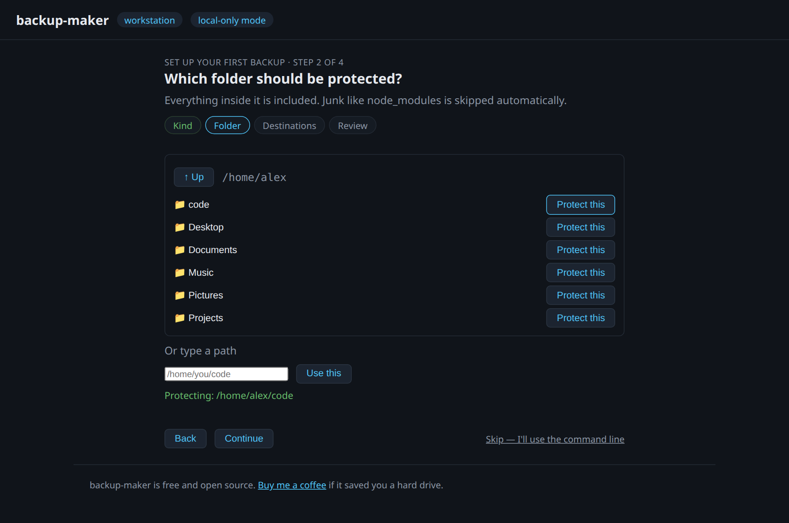

**3. Where should the copies go?** You get a list of *computers* — this one,
and any on your network sharing storage. Click one to see what it offers, and
tick as many destinations as you like, across as many machines as you like.

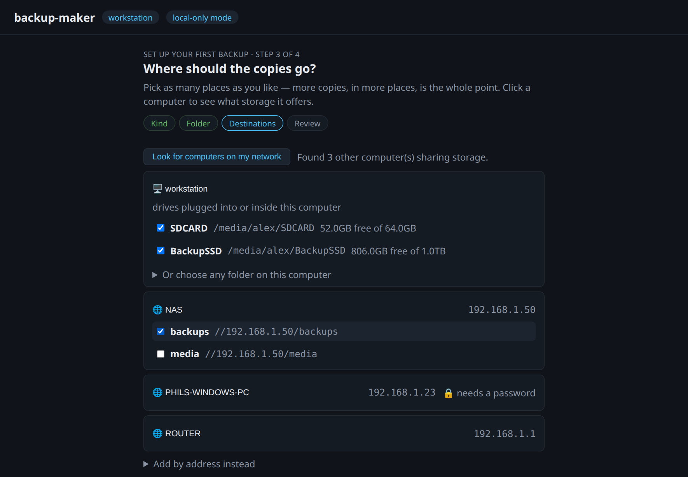

A locked computer asks for credentials right there — nothing to install on it.
And a second internal disk, or any folder at all, works just as well: "Or
choose any folder on this computer".

**4. Check it over and start.** Nothing is written until you confirm, and if
any destination can't be reached, *nothing* is saved — you never end up half
protected while believing otherwise.

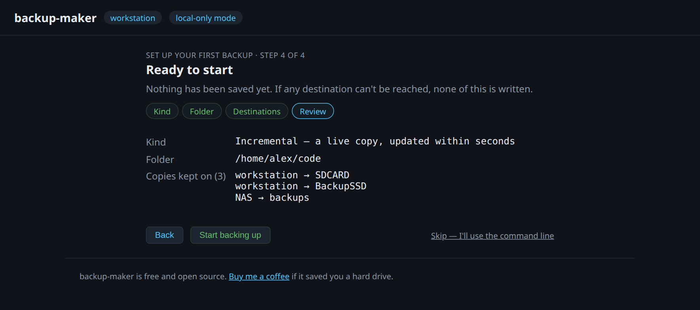

**Timed backups get one extra step** — how often, the password, and whether to
**include everything**. Snapshots normally skip the same junk as the mirror;
ticking that option seals `node_modules` and build output into the archive while
the live mirror stays lean. There is no recovery path if the password is lost,
and the wizard says so rather than burying it.

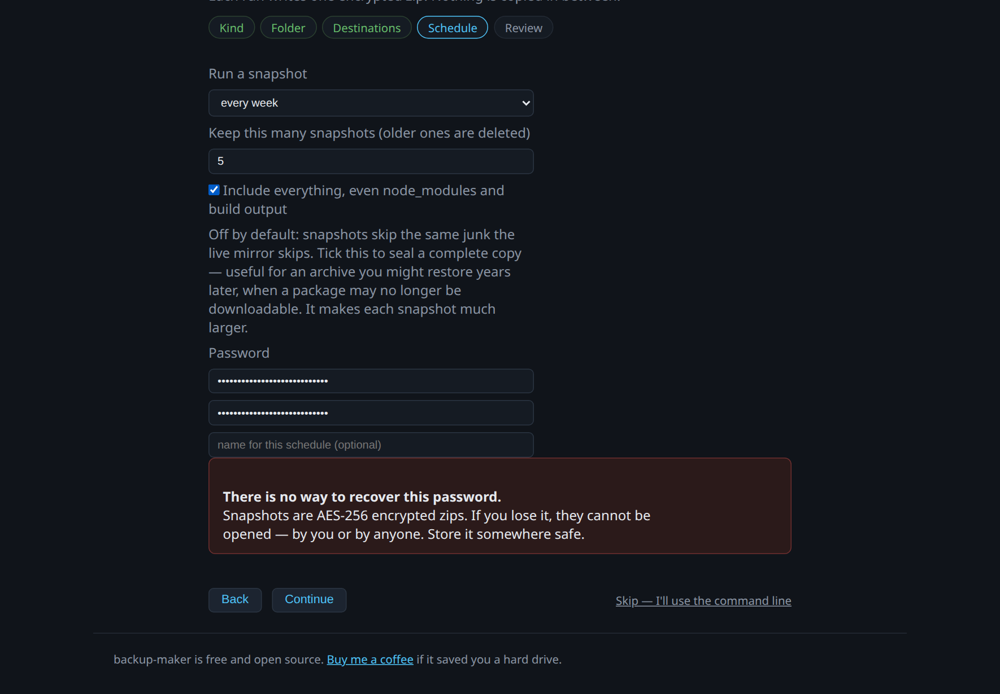

### Adding a second backup to the same folder

A folder can have more than one kind of backup. Run the wizard again and the
folder step offers what you're already protecting:

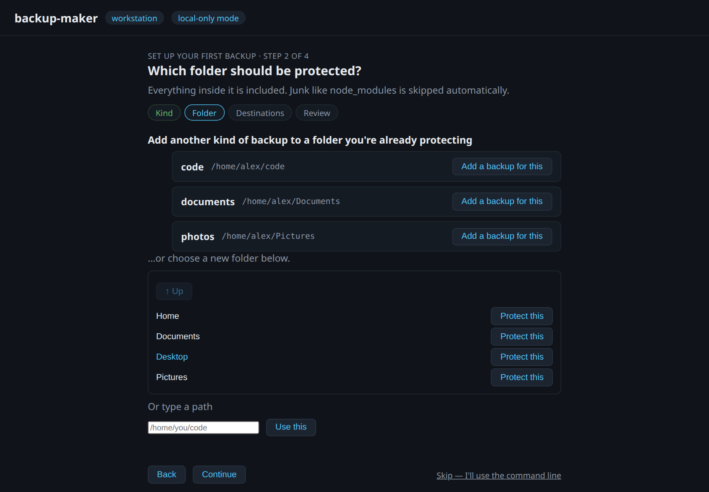

So a folder mirrored continuously to an SD card can also get a daily snapshot on
a different drive, without being set up twice.

### Watching it work

The dashboard shows every folder against every destination, what's being
protected, and where it all goes.

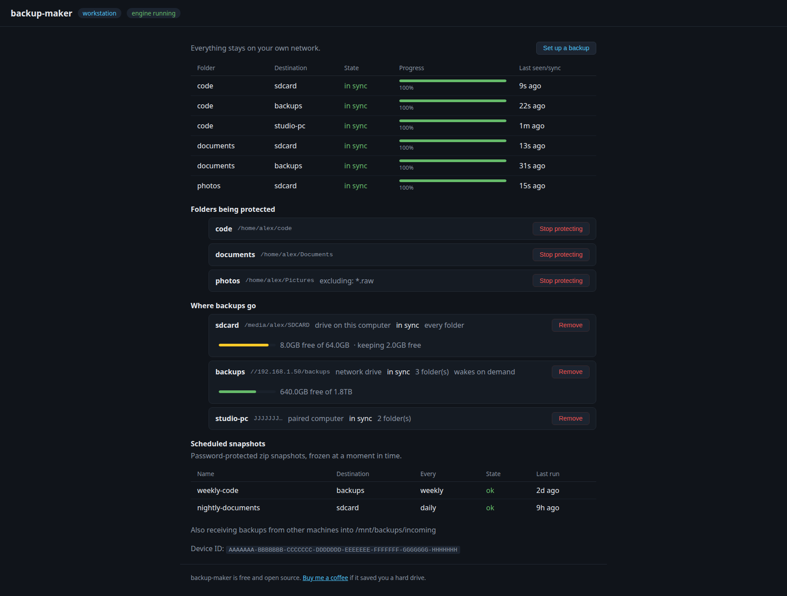

While files are moving you get live progress per destination — real byte
counts, updating in place. Nothing needs refreshing.

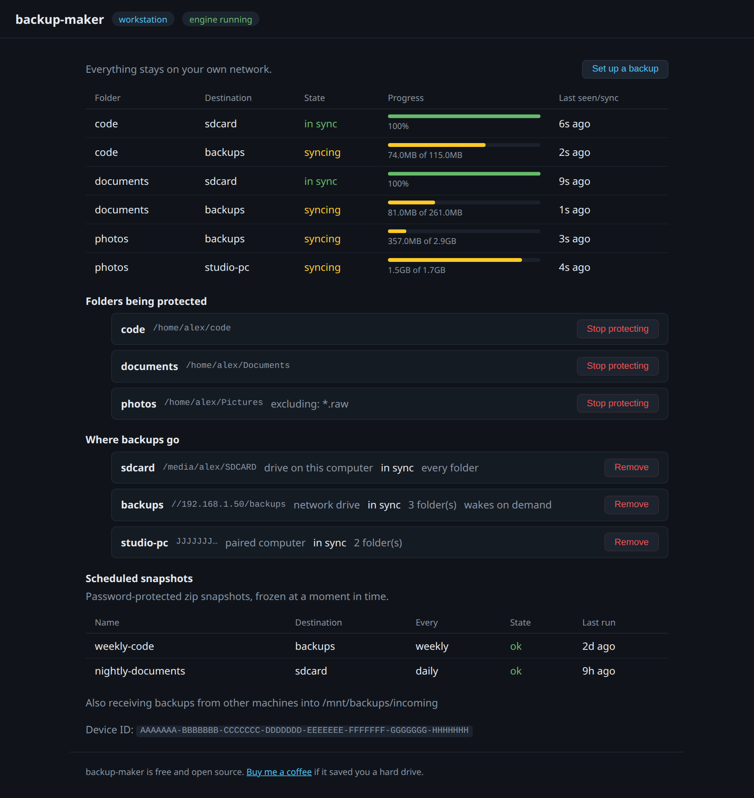

Each destination also shows how full it is — a usage bar and "312GB free of
1.8TB", turning amber as it tightens and red once it crosses the headroom you've
reserved (see [When a destination fills up](#when-a-destination-fills-up)). A
destination that's asleep or unreachable keeps its last reading, marked "as of
2h ago", rather than the bar vanishing. Free space is read once a minute, so
watching the dashboard never hammers a network drive.

When something is wrong it says so plainly: a destination that's offline, one
unreachable long enough to go stale, or another machine asking to pair.

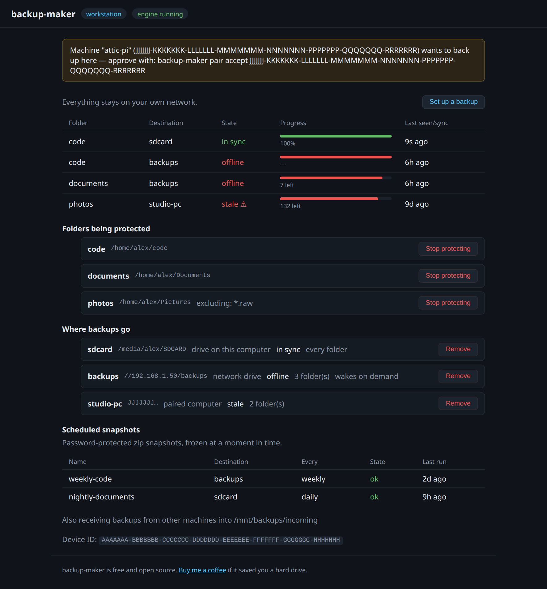

### Watching from another device on your network

By default the dashboard answers only on this computer. If you'd like to check
backup progress from a phone or another PC, turn on the read-only network view:

```toml
[general]
lan_view = true          # off by default
lan_view_port = 8667     # must differ from dashboard_port
```

The daemon then logs the address to open, along with the MAC to reserve it
against on your router:

```
read-only network view listening url=http://192.168.1.20:8667
  interface=eth0 mac=aa:bb:cc:dd:ee:ff
  note="reserve this address on your router to keep the URL stable"
```

**It is genuinely read-only.** Setting up, changing or removing a backup —
and browsing the filesystem — remain possible only on the computer itself.
That isn't a UI convention: the network view is a separate listener with an
**allow-list** of routes, so anything not explicitly permitted is refused,
including routes added in future versions. Authenticating doesn't change it;
a valid token still gets `403` on anything that writes. The token exchange
(`/auth`) isn't served there at all, so your token never crosses the network.

**No password needed, and no paths shown.** Any device on your network can open
it and see whether backups are working. What it deliberately does *not* show is
the shape of your machine: folder **labels** appear ("code", "photos") but not
their paths, destinations appear by **name** but not their addresses, and the
device ID and receive folder are omitted. "Are my backups working?" is
reasonable to publish to your wifi; "here is my directory layout and where my
NAS lives" is not.

The page notices it's the read-only view and hides the controls it can't use,
rather than showing buttons that fail when tapped:

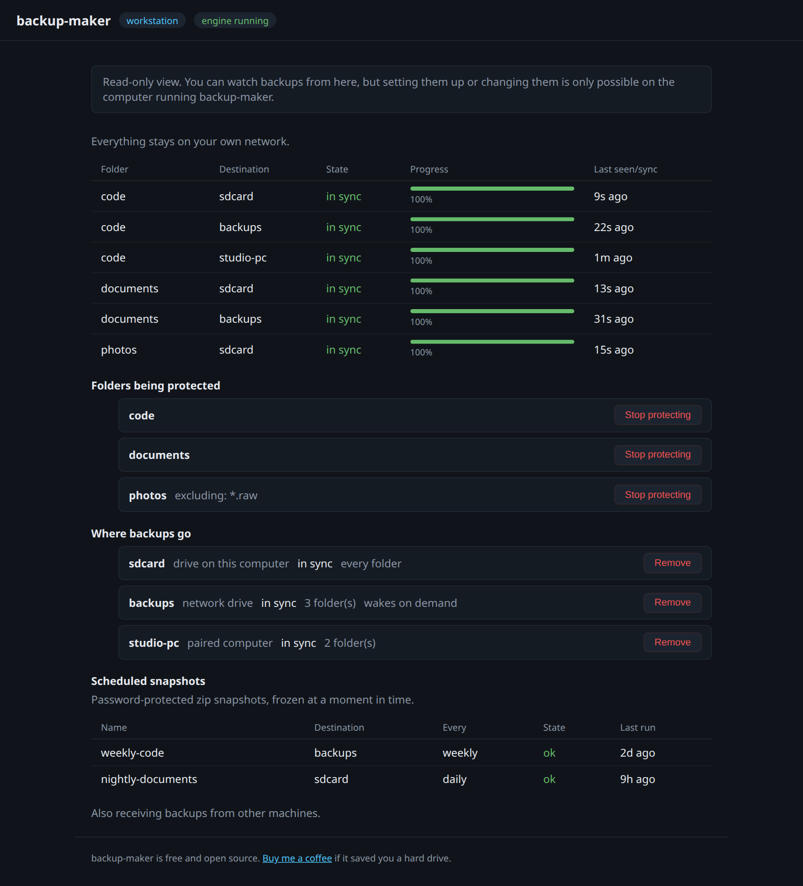

Two things worth knowing:

- **An application can't reserve an IP address.** Your machine's address comes
  from your router, and a service can only bind an address the host already
  has. To stop the URL changing, set a **DHCP reservation** on the router using
  the MAC shown above. And nothing can serve this view while the computer is
  off — there's no software running to answer.

### Checking backups when your computer is off

The dashboard is served by the computer being backed up, so it goes dark
exactly when you most want it — when that machine is asleep, broken or stolen.

So backup-maker also writes a small **status page onto each destination**,
beside the backups:

```
/mnt/backups/
  ├─ backup-maker-status.html   ← open this from any device
  ├─ workstation/code/…
  └─ backup-maker-archives/…
```

It's a single self-contained file — no web server needed. Browse the share from
a phone or another PC and open it. If that destination is a Pi or NAS with a web
server, point it at that folder and the page is a URL anyone on your network can
visit, whether or not your computer is running.

**It refuses to pretend it's current.** The page leads with *"last reported 4
minutes ago"*, recomputed in your browser each time you open it. Past an hour it
stops presenting itself as status at all:

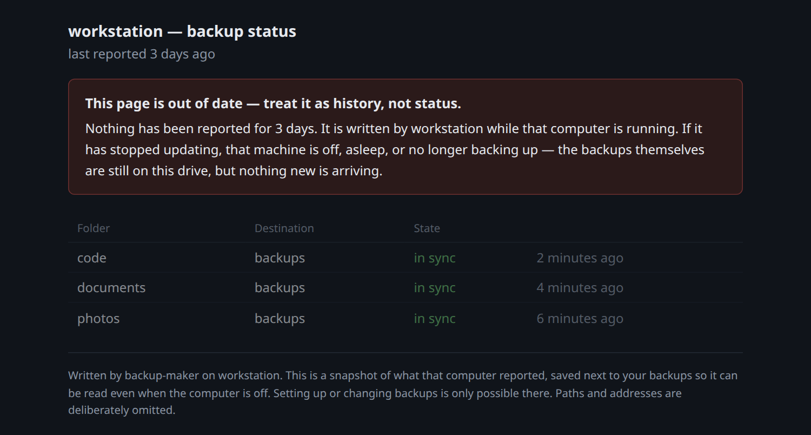

That warning is the whole point. A page cheerfully reporting "all in sync" from
a machine that died last week is worse than no page: it is false reassurance,
and it would be discovered during a restore. Knowing a machine **stopped**
backing up three days ago is the single most valuable thing this can tell you.

Like the network view, it carries folder **labels** and destination **names**
only — never paths or addresses.

### On a small screen

The dashboard adapts to narrow windows and phone-sized screens — the status
table scrolls sideways rather than squashing its columns.

Worth being straight about how you'd get there, though: the dashboard listens
on `127.0.0.1` only, so **a phone on your network cannot simply open it**.
Reaching it from a phone means running an SSH client app and forwarding the
port, which is genuinely fiddly:

```sh
ssh -L 8666:127.0.0.1:8666 you@the-machine
```

then opening <http://127.0.0.1:8666> on the phone. In practice this layout
earns its keep more often for a narrow browser window, a split screen, or a
tablet — and for checking a headless machine you're already SSH'd into.

| Setting up | Watching progress |
| --- | --- |
| 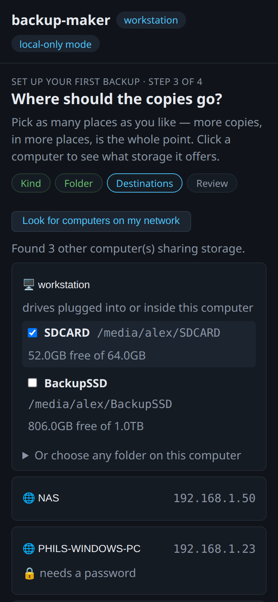 | 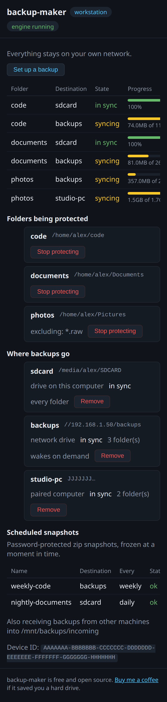 |

Prefer the command line? Everything above has a CLI equivalent — carry on
below, and use `backup-maker wizard` for the terminal version.

## A setup worth copying

If you're not sure how to arrange things, this is the shape that covers the most
failure modes for the least money — and it's what the author runs.

**One computer to protect, two places to put the copies:**

| | Where | Kind | Protects against |
| --- | --- | --- | --- |
| 1 | A card or small drive left in the computer | incremental | *"I broke this an hour ago"* — instant, no network |
| 2 | An always-on box (a Raspberry Pi, a NAS) | incremental | The computer being lost, stolen, dropped or drowned |
| 3 | The same always-on box | timed, daily | *"Put it back how it was last Tuesday"* |

Tasks 1 and 2 are **one wizard run** with two destinations ticked. Task 3 is a
second run against the same folder, choosing *Timed*.

**Why all three.** A card inside the computer is the fastest to recover from and
the first to be stolen along with it. An always-on box on the far side of the
room survives that, and — because it stays powered — it's the one that can hold
a [status page](#checking-backups-when-your-computer-is-off) you can read when
the computer is off. And the daily snapshot covers what neither mirror does: a
mistake you don't notice for a week, by which time both mirrors have faithfully
copied it.

**On the always-on box**, either arrangement works and backup-maker only ever
installs on the computer being protected:

- **Share a folder from it** (Samba on a Pi, or a NAS's built-in sharing) and
  add it as a network drive. Nothing else to install.
- **Or run backup-maker on it too** and pair the two machines, for block-level
  verified transfers. Stronger, at the cost of a second install to maintain.

**Sizing it.** Measure before you buy: excluded junk is usually most of a
folder's size. A 21GB development folder was **1.3GB** once `node_modules`,
build output and caches were skipped — so thirty daily snapshots came to ~18GB,
not 600GB. Work out `size × snapshots kept` rather than guessing.

**One thing not to skip:** a second location. Everything above lives in one
building. A drive you occasionally carry elsewhere is what survives a fire or a
burglary — see [docs/RECOMMENDED-HARDWARE.md](docs/RECOMMENDED-HARDWARE.md).

## Quick start

```sh
backup-maker init
backup-maker add-folder ~/code        # what to protect
backup-maker daemon &                 # start the engine
backup-maker autostart enable         # survive reboots
backup-maker web                      # or set it all up in the browser
```

Then add backup targets — as many as you like, mixed freely:

**A drive in/on this computer** (SD card, USB stick, external disk):

```sh
backup-maker add-target drive /media/you/SDCARD
```

**A network drive** — a NAS, a router's USB drive, or a folder shared by any
Windows/Mac/Linux machine. Nothing is installed on the other machine:

```sh
backup-maker scan                                     # find drives on your network
backup-maker add-target share //192.168.1.1/usb1      # open/guest shares
backup-maker add-target share //NAS/backups --user bob # password-protected shares
```

**Optional: a second computer also running backup-maker.** Only worth it if you
want the strongest transfer mode (block-level verified delta sync). This is the
one case that needs backup-maker installed on both ends:

```sh
# on the other machine:
backup-maker receive enable --root D:\Backups
backup-maker pair                       # shows its device ID
# on this machine:
backup-maker add-target device <THAT-DEVICE-ID>
# back on the other machine (IDs are unforgeable — compare prefixes):
backup-maker pair accept <THIS-DEVICE-ID>
```

`backup-maker status` shows live health for every folder × destination;
`backup-maker web` opens the same as a dashboard, where the setup wizard walks
you through all of the above.

## Scheduled snapshots (encrypted point-in-time copies)

> **"Snapshot" means complete-at-a-moment, not everything on disk.** It's a
> whole copy of the folders you chose, frozen at one instant — as opposed to
> the mirror, which follows every change. By default it honours the same
> exclude list, so `node_modules` and build output are skipped in snapshots
> just as they are in the mirror.
>
> A schedule can opt out of that with **"include everything"**, which seals the
> excluded junk into the snapshot while leaving the live mirror lean. That's
> the combination worth knowing about: a small SD card mirroring only your
> source, and a bigger drive holding a complete sealed archive you could still
> restore years later, when a dependency may no longer be downloadable.


Alongside the real-time mirror, `backup-maker wizard` sets up **scheduled full
backups**: AES-256 password-protected zip snapshots of chosen folders, written
to any drive or network-drive target on a timer (hourly/daily/weekly or a
custom interval), with a retention count so old snapshots prune automatically.
The wizard also lets you select/deselect folders and exclude files or
subfolders within them.

- A password is **required** — backup-maker refuses to write an unprotected
  archive. It's stored only in the private `state.json` on your machine; if
  you lose it, the archives cannot be opened.
- Every archive is re-read and fully decrypted after writing, before it
  counts as done — proof it's restorable.
- Open archives with 7-Zip, WinRAR, Keka, or any AES-capable zip tool
  (Windows Explorer's built-in viewer can't read AES encryption).
- Missed schedules (machine asleep/off) catch up when the daemon next runs.

## Sleeping computers (read this if your drive is plugged into a PC)

If your backup drive is plugged into a computer — or *is* a computer, like a
NAS or a paired machine — and that computer is asleep, hibernating, or off,
then that target is unreachable and **nothing is backed up to it while it
sleeps.** Simply trying to reach a sleeping PC's shared drive does not wake
it.

This is the most common way people end up with a backup they *think* is
current and isn't.

backup-maker can *try* to wake such a machine with Wake-on-LAN (see
[Fix 3](#fix-3-wake-on-lan--wake-the-machine-on-demand)), but that is a
best-effort rescue with real prerequisites — not a guarantee, and not a
substitute for a target that's simply always on.

> ### Recommendation
>
> **1. Plug an external SSD into a Raspberry Pi and use that as your backup
> target.** A Pi draws a few watts, makes no noise, and *never sleeps* — a
> stock Raspberry Pi OS install has no suspend mode to fall into, so the
> problem on this page cannot happen. It costs less than most external
> drives. Setup is in the
> [next section](#raspberry-pi-as-an-always-on-backup-target).
>
> **2. A NAS**, if it's configured not to sleep. Most NAS boxes stay awake by
> default but ship with a "disk hibernation" or "HDD standby" option, and
> some vendors enable a deeper system sleep — check yours and turn it off.
> More capacity and internal redundancy than a Pi, at several times the
> price. See [docs/RECOMMENDED-HARDWARE.md](docs/RECOMMENDED-HARDWARE.md).
>
> **3. An ordinary computer you have deliberately set to never sleep** (Fix 2
> below) is equally safe. The risk isn't using a PC — it's using a PC that
> still sleeps.
>
> Wake-on-LAN (Fix 3) is the fallback for when none of those is an option.

What actually happens while the target is asleep:

- Nothing is lost on your source machine — changes keep being tracked.
- The target pauses cleanly and shows `offline` in `backup-maker status`.
- When the machine wakes, that target catches up exactly, without recopying
  everything.
- After 7 days unseen, status flags it stale (`!!`). **Check your status
  regularly** — a target that only wakes when you happen to use that computer
  can sit hours or days behind.

Note the difference between two things that sound alike:

- **The drive spinning down** (an idle external disk parking its heads) is
  harmless — it wakes automatically on the next access, and backup-maker
  never notices.
- **The host computer sleeping** stops everything, because the USB port, the
  network card, and the file-sharing service are all powered down with it.

### Fix 1 (best): use a target that never sleeps

Move the drive to something built to stay on — a Raspberry Pi, a NAS, or a
router USB port. This is the only fix that needs no ongoing attention and
can't be undone by a future Windows update resetting your power settings.

### Fix 2: stop the host computer from sleeping

Keep the machine awake and it will serve the drive continuously. Screen-off
is fine; it's *system* sleep you need to disable.

**Windows** — Settings → System → Power & battery → Screen and sleep → set
**"When plugged in, put my device to sleep after" = Never**. Then, because
two other settings can still cut off access:

```
powercfg /change standby-timeout-ac 0     # never sleep on AC
powercfg /change hibernate-timeout-ac 0   # never hibernate on AC
```

Also open Device Manager → Network adapters → your adapter → Properties →
Power Management and **uncheck "Allow the computer to turn off this device to
save power"**, and do the same for **USB Root Hub** entries if the drive drops
off. On a laptop, Control Panel → Power Options → "Choose what closing the lid
does" → set **"Do nothing"** when plugged in.

**macOS** — System Settings → Displays → Advanced → enable **"Prevent
automatic sleeping on power adapter when the display is off"**, or from the
terminal:

```sh
sudo pmset -a sleep 0 disksleep 0
```

macOS is the one platform where sleep can genuinely be survivable: enable
**"Wake for network access"** (`sudo pmset -a womp 1`), and on Apple hardware
with a Bonjour Sleep Proxy on the network, an incoming file-sharing request
can wake the Mac. It's convenient but not something to bet your only backup
on — the first write after wake can still time out.

**Linux** — mask the sleep targets outright:

```sh
sudo systemctl mask sleep.target suspend.target hibernate.target hybrid-sleep.target
```

(and turn off automatic suspend in your desktop's power settings).

### Fix 3: Wake-on-LAN — wake the machine on demand

backup-maker can broadcast a Wake-on-LAN "magic packet" to a sleeping target.
Give a target the MAC address of the machine behind it and, whenever that
target is offline, the daemon tries to wake it (at most once every 5 minutes,
so it never floods your network):

```sh
backup-maker set-mac <target> aa:bb:cc:dd:ee:ff   # enable
backup-maker wake <target>                        # test it now
backup-maker set-mac <target> none                # disable
```

You can also set it when creating the target:

```sh
backup-maker add-target share //NAS/backups --mac aa:bb:cc:dd:ee:ff
backup-maker add-target device <DEVICE-ID> --mac aa:bb:cc:dd:ee:ff
```

Read the honest limits first:

- **It is best-effort and unacknowledged.** A magic packet is fire-and-forget
  UDP. `backup-maker wake` succeeding means "the packet left this machine",
  never "the target is awake".
- **Wifi almost never works.** Most wifi adapters lose power on sleep and stop
  listening. Treat WoL as an **ethernet-only** feature.
- **It won't cross subnets or the internet.** The packet is a LAN broadcast —
  consistent with backup-maker being local-only, and it cannot reach a machine
  outside your network.
- **The machine will go back to sleep** on its own timer, possibly mid-copy.
  A large first backup may need several wake cycles to finish.
- **It usually won't work from a full power-off** unless the BIOS explicitly
  supports waking from S5 ("Power On By PCI-E"). Sleep and hibernate are the
  reliable cases.

Because of all that: WoL makes a sleeping target *much* better than nothing,
but a target that never sleeps is still strictly better.

#### Step 1: find the MAC address (on the target machine)

Use the **wired ethernet** adapter's address:

| OS | Command |
| --- | --- |
| Linux | `ip link` — the `link/ether` line under your ethernet interface |
| macOS | `ifconfig en0 \| grep ether` |
| Windows | `getmac /v` (or `ipconfig /all` → "Physical Address") |

#### Step 2: enable Wake-on-LAN in the target's BIOS/UEFI

This is the step people skip, and nothing else works without it. Reboot into
BIOS/UEFI setup (usually <kbd>Del</kbd>, <kbd>F2</kbd>, or <kbd>F10</kbd> at
power-on) and enable whichever of these your board calls it:

- "Wake on LAN" / "Wake on PCI-E" / "Power On By PCI-E"
- "Resume by PCI-E Device" / "PME Event Wake Up"

On many Windows machines you must **also disable "Fast Startup"** (see below),
because it makes shutdown a hibernation state that ignores wake events.

#### Step 3: enable it in the target's OS

**Windows**

Device Manager → Network adapters → your **wired** adapter → Properties:

- *Power Management* tab → tick **"Allow this device to wake the computer"**
  and **"Only allow a magic packet to wake the computer"**. Leave "Allow the
  computer to turn off this device to save power" **unticked**.
- *Advanced* tab → set **"Wake on Magic Packet"** to *Enabled*. If present,
  also enable "Wake on pattern match" and set "Energy Efficient Ethernet" to
  *Disabled* (it can drop the link on idle).

Then disable Fast Startup, which otherwise breaks waking after shutdown:

```
powercfg /hibernate off        # simplest, also frees disk space
```

or leave hibernate on and untick Control Panel → Power Options → "Choose what
the power buttons do" → "Turn on fast startup".

**macOS**

```sh
sudo pmset -a womp 1     # "wake on magic packet"
pmset -g | grep womp     # verify: should print 1
```

On Apple laptops this only applies while on power; on wifi it depends on a
Bonjour Sleep Proxy being present and is unreliable. Ethernet is dependable.

**Linux**

Check what the adapter supports (`g` = wake on magic packet):

```sh
sudo ethtool eth0 | grep -i wake     # "Supports Wake-on: pumbg" / "Wake-on: d"
sudo ethtool -s eth0 wol g           # enable ("d" = disabled)
```

That resets on reboot. Make it stick with a systemd unit:

```sh
sudo tee /etc/systemd/system/wol.service >/dev/null <<'EOF'
[Unit]
Description=Enable Wake-on-LAN
After=network-online.target

[Service]
Type=oneshot
ExecStart=/usr/sbin/ethtool -s eth0 wol g

[Install]
WantedBy=multi-user.target
EOF
sudo systemctl enable --now wol.service
```

(Replace `eth0` with your interface name from `ip link`. On NetworkManager
you can instead run `nmcli connection modify <name> 802-3-ethernet.wake-on-lan
magic`.)

#### Step 4: test it

Put the target to sleep, then from the backup-maker machine:

```sh
backup-maker wake <target>
backup-maker status          # the target should return within a minute
```

If nothing happens, work backwards: BIOS setting, then the OS setting, then
whether you used the wired adapter's MAC. If your machines are on different
subnets or a VLAN, point the packet at the right broadcast address:

```sh
backup-maker set-mac <target> aa:bb:cc:dd:ee:ff --broadcast 192.168.1.255
```

## Raspberry Pi as an always-on backup target

### Why an always-on destination matters

This is the single most important choice you'll make, so it's worth being
explicit about why:

1. **Real-time backups only happen while the destination is awake.** A drive
   attached to a computer that sleeps, or a machine you switch off at night,
   receives nothing while it's down. Your backup is only as current as the last
   moment that destination was reachable — and you won't notice the gap until
   you need the file.
2. **It survives the fate of your computer.** A card left in your laptop's slot
   is genuinely useful and costs nothing extra, but theft, a power surge, a
   spilled drink or ransomware take the laptop and that card together. A
   separate box on the far side of the room doesn't share those.
3. **You can check on it independently.** If your computer is off, broken or
   stolen, an always-on destination is still sitting there on your network: you
   can browse it from a phone or another PC and confirm your files are really
   present, with the dates you expect. A drive that only exists inside the dead
   machine leaves you nothing to look at until it comes back.

A Raspberry Pi with an external SSD is the cheapest way to get all three: a few
watts, silent, and with no sleep mode to fall into. Two ways to use one:

**A. As a paired machine (recommended).** Run backup-maker on the Pi and pair
it. This is the strongest target type: block-level delta sync with
verification, plus versioned history.

**B. As a network drive.** Install Samba on the Pi, share the drive, and add
it with `backup-maker add-target share`. Slightly simpler, and you skip
installing backup-maker on the Pi, but you give up delta sync.

### Pi or NAS?

Both work, and backup-maker treats them the same way — a NAS is just a network
drive, and so is a Pi running Samba.

| | Raspberry Pi + external SSD | NAS |
| --- | --- | --- |
| Cost | a fraction of a NAS | several times more |
| Power / noise | a few watts, silent | more, often audible |
| Capacity | one drive | several, expandable |
| Disk redundancy | none | RAID on multi-bay models |
| Setup | you install the OS and Samba | works out of the box |

**Don't over-value the redundancy column.** A NAS's RAID protects against *a
disk failing*. It does not protect against deleting a file, a bad edit,
ransomware, theft, or fire — the mirror faithfully copies all of those to both
disks instantly. RAID is uptime insurance, not a backup. That makes a
single-disk Pi a much smaller compromise than it first appears, as long as you
keep **more than one destination** — which is the whole reason backup-maker
lets you tick several at once.

Buy a NAS if you need the capacity or want the convenience. For protecting one
or two computers, a Pi with a good external SSD does the same job for the
money you'd spend on the NAS's empty enclosure.

### Building for the Pi

Check which OS you're on first — it decides everything:

```sh
uname -m      # on the Pi
```

- **`aarch64`** — 64-bit Raspberry Pi OS. Fully supported. Cross-compile from
  your main machine:

  ```sh
  GOOS=linux GOARCH=arm64 go build -trimpath -o backup-maker-pi .
  scp backup-maker-pi pi@raspberrypi.local:~/backup-maker
  ```

- **`armv7l`** — 32-bit Raspberry Pi OS. Build with `GOARCH=arm GOARM=7`.
  Drive and network-drive targets work normally, but **paired-machine targets
  need Syncthing installed yourself** (`sudo apt install syncthing`) — there
  is no pinned 32-bit ARM build to download, and backup-maker will fall back
  to the system one. If you have the choice, reinstall with 64-bit Pi OS.

Pi 3 and newer can run 64-bit; Pi Zero (original) and Pi 1 are ARMv6 and are
not practical targets.

### Setting it up (paired-machine route)

On the Pi:

```sh
./backup-maker init
./backup-maker receive enable --root /mnt/backups
./backup-maker pair                     # prints this Pi's device ID
./backup-maker autostart enable
sudo loginctl enable-linger $USER       # ESSENTIAL on a headless Pi
```

That last line is not optional. Autostart installs a **systemd user unit**,
and without lingering enabled, systemd stops your user's services the moment
your SSH session ends — the backup daemon would die every time you log out.

Then on your main machine:

```sh
backup-maker add-target device <PI-DEVICE-ID>
```

and back on the Pi, `./backup-maker pair accept <YOUR-DEVICE-ID>`.

### Pi-specific storage advice

- **Back up to an external USB drive, never the microSD card.** The card holds
  the OS and will wear out under constant writes; a backup that dies with the
  card defeats the point.
- **Use a supply that can deliver 5V at 5A** (the official Pi 5 one). With a
  weaker 3A supply the Pi clamps total USB current to 600mA, which a
  bus-powered SSD can exceed on writes. The failure mode is nasty: dropped
  drives and corrupted files that look like a dying disk rather than a power
  problem. Third-party "compatible" bricks that sag under load cause the same
  thing.
- **Use a powered USB hub or a self-powered drive** for spinning USB disks, or
  if the drive misbehaves even on a good supply. An under-powered Pi drops the
  drive mid-write, which shows up as a destination that keeps going offline.
- **Mount by UUID in `/etc/fstab`** so the drive lands at the same path after
  every reboot — backup-maker refuses to write to a target whose marker file
  doesn't match, which is exactly what a shuffled `/media/...` path looks
  like. Add `nofail` so a missing drive doesn't block boot.
- **ext4 is the right format** for a drive only the Pi will touch. Use exFAT
  only if you'll also plug it into Windows/macOS directly (`sudo apt install
  exfat-fuse`).

### Reaching the dashboard on a headless Pi

The dashboard binds to `127.0.0.1` only and is never exposed to the network.
Reach it over an SSH tunnel from your desktop:

```sh
ssh -L 8666:127.0.0.1:8666 pi@raspberrypi.local
```

then open <http://127.0.0.1:8666> locally. (8666 is the default
`dashboard_port`.) Everyday health checks need no tunnel — just
`ssh pi@raspberrypi.local ./backup-maker status`.

## What gets backed up

Everything in the folders you add, except common junk (`node_modules`,
`__pycache__`, build dirs, caches — see `config.toml`). `.git` **is** backed
up: losing repositories is unacceptable. Override per folder with
`--ignore`/`--no-default-ignores`.

## Restoring

Backups are plain files — no special format. Copy them back with any file
manager. Old versions of changed/deleted files live in
`.backup-maker-versions/` (drive and network targets, at the target root) or
`.stversions/` (machine targets), named `file~20260721-153000.txt`. Restore by
copying out; don't edit files inside a backup target in place.

## Safety properties

- Every target is stamped with a marker file; if *different* storage shows up
  at the same location, backup-maker refuses to touch it.
- Files written to network drives are **read back and checksum-verified** by
  default (SMB has no end-to-end integrity checking of its own; disable per
  target with `--no-verify`).
- A drive being unplugged, a NAS powering off, or wifi dropping pauses that
  target cleanly; on return it catches up exactly, without recopying
  everything. A target with a MAC address configured is also sent a
  Wake-on-LAN packet while it's offline (best-effort — see
  [Sleeping computers](#sleeping-computers-read-this-if-your-drive-is-plugged-into-a-pc)).
- Writes are atomic (temp file + rename) — a power cut or connection drop
  mid-sync never leaves a half-written file visible.
- Targets that don't preserve file timestamps (some router/NAS firmware) are
  detected automatically and compared by size + recency instead.
- Changes made *on a target* are never synced back to the source.
- A target unseen for 7 days shows a stale warning (`!!`) in status.

## When a destination fills up

By default, nothing is ever deleted to make room — backup-maker just reports
that the destination is full. If you'd rather it kept itself tidy, set a
headroom figure:

```toml
[defaults]
min_free_gb = 5          # keep 5GB free everywhere
```

```toml
[[target]]
name = "sdcard"
min_free_gb = 2          # ...but only 2GB on the little SD card
```

Whatever you set here is shown on each destination's card ("keeping 5GB free"),
and its usage bar turns red as free space approaches the reserve — so the figure
isn't buried in a config file nobody reads.

When free space drops below that — or a write fails because the disk filled up
— backup-maker deletes the **oldest backup history** until there's room, then
carries on.

**What it will delete:**

- old file versions in `.backup-maker-versions/`
- old scheduled snapshots, **except the newest of each job**

**What it will never delete:**

- **the live mirror** — that *is* the backup. A destination missing files while
  still looking healthy is the worst possible failure, because you'd only find
  out during a restore.
- **a snapshot job's only remaining archive** — deleting it would leave that
  backup with no protection at all.

Deletion is spread **evenly across your folders**, oldest first, so one large
folder can't quietly consume every other folder's history. Every deletion is
logged and shown on the dashboard ("freed 2GB by deleting 14 old backup
files") — automatically removing your backup history should never be silent.

If there's nothing left that's safe to delete, the destination is marked
**full** and says so, rather than retrying forever. A destination too small to
hold even one copy of your folders can't be rescued by deleting history; that's
a hardware problem, and backup-maker will tell you so instead of thrashing.

Not available for paired-machine destinations: that machine runs its own
backup-maker and manages its own storage.

## Credentials & security notes

- Network-drive passwords are stored in `state.json` (file mode 0600, next to
  the config) — never in the shareable `config.toml`. Update them with
  `backup-maker set-password <target>`.
- The built-in SMB client speaks SMB 2/3 only. Devices that offer nothing but
  SMB1 (very old routers/NAS) aren't supported — check for a firmware update.
- Automatic deletion to reclaim space is **off unless you set `min_free_gb`**,
  and even then only ever removes old versions and old snapshots — never the
  live copy, and never a snapshot job's last archive.
- Wake-on-LAN is **opt-in per target** — no packet is ever sent unless you
  give that target a MAC address. Magic packets are local-network broadcasts
  that carry nothing but the target's own MAC (no data, no credentials), so
  they stay within `lan-only` mode. They are only sent while that target is
  offline, at most once every 5 minutes.
- **There is no off-site mode.** The sync engine is pinned to your local
  network: public discovery, relays and NAT traversal are switched off in code,
  with no setting to re-enable them, so this machine is never announced to any
  outside service. For a copy that survives the building, rotate a drive to
  another location.

## Config

`~/.config/backup-maker/config.toml` (Linux) / `%AppData%\backup-maker`
(Windows) / `~/Library/Application Support/backup-maker` (macOS). Hand-edit
freely — the running daemon picks changes up within seconds.

## Architecture

One long-lived process (`backup-maker daemon`) hosts three subsystems:

1. **Syncthing supervisor** (`internal/syncthing`) — for paired-machine
   targets. Started lazily: only when a device target or receive mode is
   configured does it download a pinned, SHA256-verified Syncthing v2.1.2
   (once), run it as a child process with an isolated home dir (never touching
   a user's own Syncthing), and drive it via its loopback REST API.
   Drive/share-only setups never start or fetch it. Source folders
   are `sendonly`, receiving machines enforce `receiveonly` + staggered
   versioning. Local-only, enforced in code: global discovery, relays, NAT
   traversal, and
   telemetry disabled.
2. **Mirror engine** (`internal/localmirror`) — for drive and network-drive
   targets. One goroutine per folder × target: fsnotify watching with
   debounce, hourly full-reconcile backstop, atomic writes (temp + fsync +
   rename), delete-propagation-as-versioning into `.backup-maker-versions/`
   with staggered pruning, UUID marker files for foreign-storage refusal. The
   destination is abstracted behind a `Backend` interface with two
   implementations: `localFS` (os calls) and `smbfs` (built-in SMB 2/3 client,
   `github.com/cloudsoda/go-smb2`). SMB targets add read-back SHA256
   verification and mtime self-calibration (servers that ignore timestamps
   get size+recency comparison).
3. **Web UI / API server** (`internal/webui`) — stdlib `net/http` bound to
   `127.0.0.1` only, vanilla JS + `go:embed` (no build chain). Token-auth
   (bearer for CLI, cookie for browser; the cookie is `HttpOnly` +
   `SameSite=Strict`, and a `Host`-header check rejects anything but
   loopback). The CLI's mutating commands edit `config.toml`; the daemon
   watches the file and reapplies within seconds.

Other packages: `internal/config` (TOML config + private `state.json`),
`internal/setup` (folder/target/archive creation shared by the CLI and the
dashboard, including the all-or-nothing multi-destination commit),
`internal/browse` (directory listing for the folder picker — directories only,
never file names — plus local drive detection), `internal/machines` (presents
destinations as a list of computers rather than a mix of paths, share URLs and
device IDs), `internal/discover` (on-demand LAN scan: TCP 445 sweep +
hand-rolled NetBIOS name query + guest share listing), `internal/wol`
(Wake-on-LAN magic packets, rate-limited per target), `internal/pairing`
(device approval,
auto-accept of offered folders as receive-only), `internal/status` (unified
health model for CLI table + dashboard), `internal/autostart` (systemd user
unit / launchd agent / Windows Run key), `internal/setup` (target-creation
flows shared by CLI and dashboard), `cmd/` (cobra CLI).

## Status & roadmap

Implemented and E2E-tested: all three target types (local drive, SMB network
drive, paired machine), real-time sync, versioning, offline/catch-up,
wrong-drive refusal, read-back verification, on-demand network scan,
scheduled encrypted archive snapshots (CLI wizard and browser), automatic
space reclamation on full destinations, Wake-on-LAN
for sleeping targets, the browser setup wizard with folder picker and
machine/storage browsing, live per-destination transfer progress, folder and
destination management from the dashboard, a read-only network view for other
devices, a status page written to each destination, autostart, unit/conformance tests
(`go test ./...`; SMB suite runs against a real server via `BM_SMB_TEST_URL`),
plus an end-to-end browser test that drives the real dashboard against a real
daemon.

Not yet built: adopting an existing destination after reinstalling on a new
machine, QR-code pairing, one-click revert for receive-side drift,
goreleaser packaging/releases, Windows firewall helper command, OS-keychain
credential storage. Known rough edge: a single very large file leaves the
progress bar static until it lands, because progress is counted per completed
file rather than per byte.

## Building from source

Requires Go 1.22+. `go build` produces the single binary; cross-compile with
`GOOS=windows go build`, etc. (Release builds should use `-trimpath` so no
local filesystem paths end up in the binary.) Run the SMB integration tests
against any SMB server:
`BM_SMB_TEST_URL=//host:port/share BM_SMB_TEST_USER=u BM_SMB_TEST_PASS=p go test ./internal/smbfs`.

## Support

backup-maker is free and open source, built and maintained by one person. If
it saved you a hard drive, you can
[buy me a coffee](https://ko-fi.com/phil9922). ☕

## License

MIT License — see [LICENSE](LICENSE). Third-party components and their
licenses are listed in [THIRD-PARTY-NOTICES.md](THIRD-PARTY-NOTICES.md); the
Syncthing engine (MPL-2.0) is downloaded as a separate, unmodified official
binary at first run.
