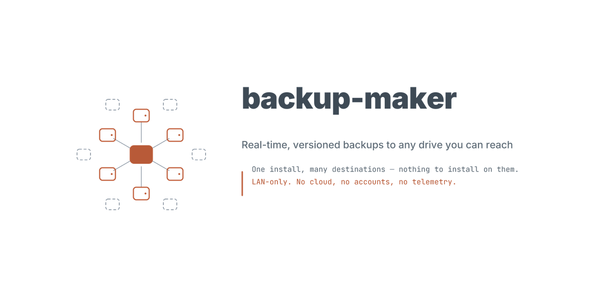
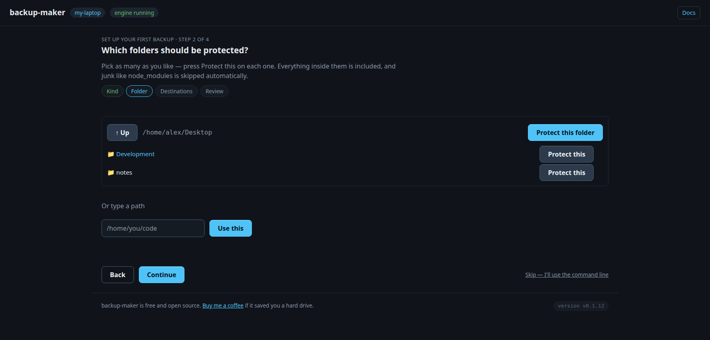
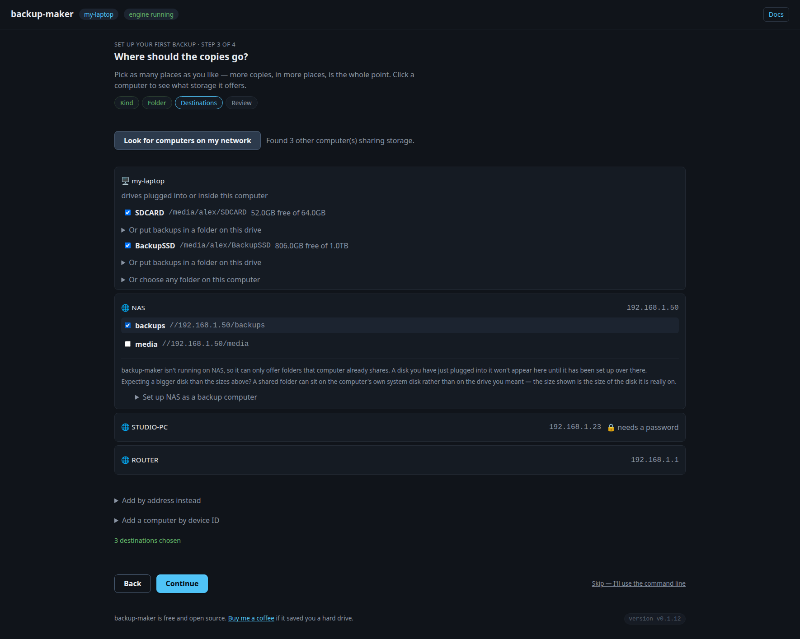
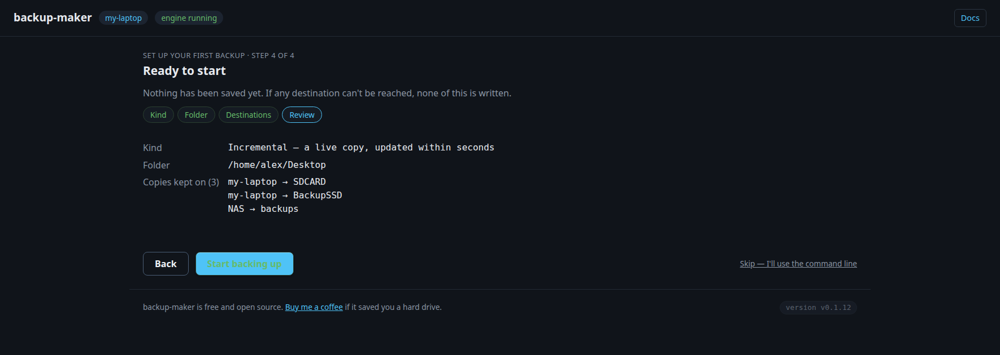
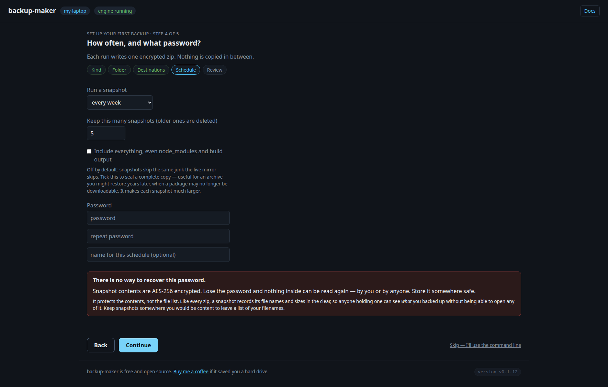
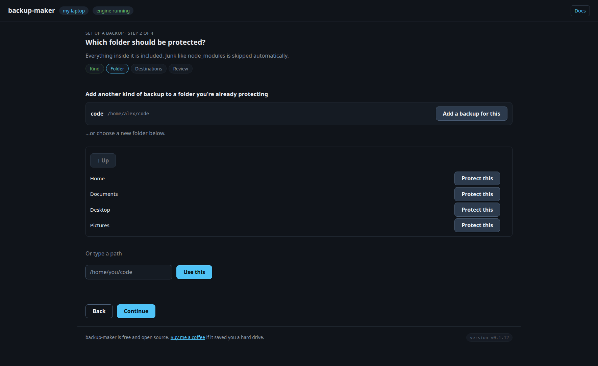
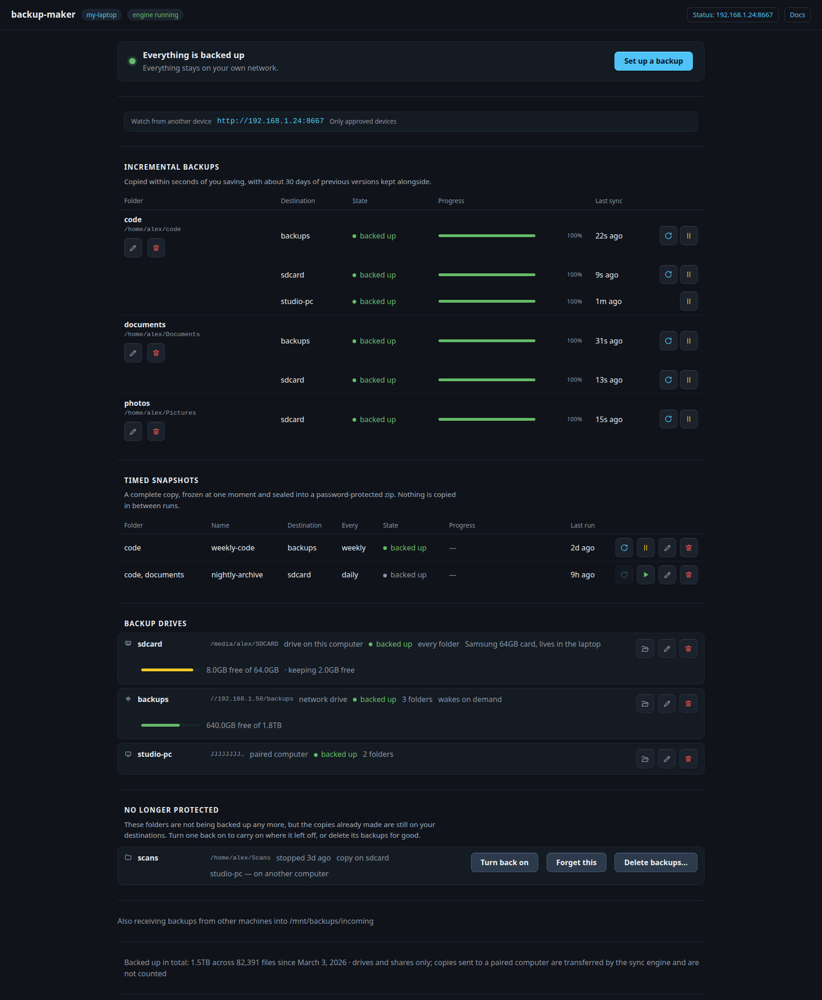
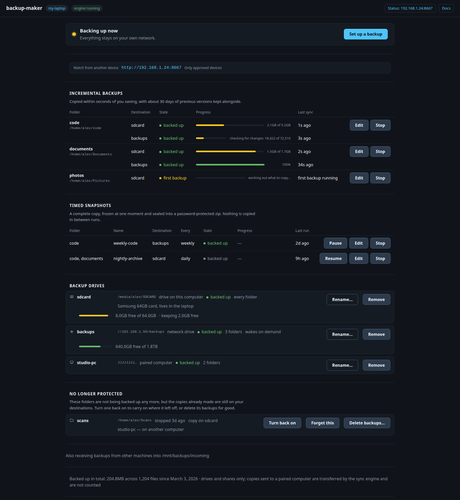
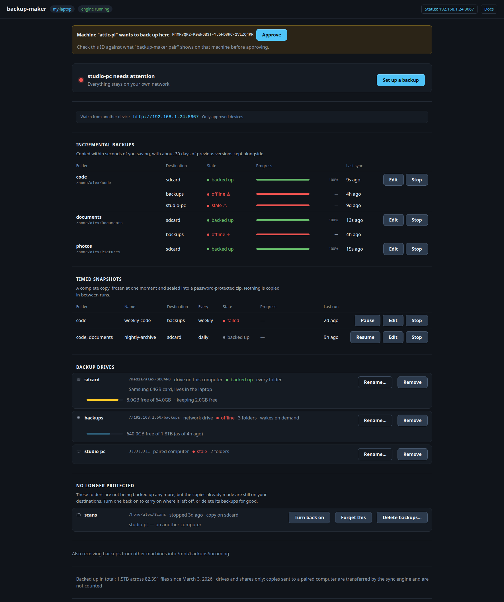

<p align="center">
  <picture>
    <source media="(prefers-color-scheme: dark)" srcset="img/header-dark.png">
    
  </picture>
</p>

# backup-maker

**Install it on the one computer you want protected.** Everything else is just
somewhere to put the copies — no software to install over there, no accounts,
nothing leaving your network.

Every folder you choose is mirrored, in real time, onto as many places as you
like at once:

- **a drive inside or plugged into that computer** — an SD card, a USB stick,
  an external disk
- **a USB drive plugged into your router**
- **a NAS**
- **a shared folder on any Windows, Mac or Linux machine** on your network —
  if it can share a folder, it can hold your backups, with **nothing installed
  on it**

That's the whole model: one install, many destinations.

> **Optionally**, a second computer can also run backup-maker and pair with the
> first. That unlocks the strongest transfer mode (block-level, verified, delta
> sync) and works between any operating systems — but it is an upgrade, not the
> point. You never need it.

### Fully self-hosted, and local by design

Your backups go to hardware you own, over your own network. There is **no cloud
service, no account, no telemetry, and no off-site mode** — not disabled by
default, but absent. The sync engine is locked to your local network: public
discovery, relays and NAT traversal are all switched off with no setting to
turn them back on, so your machine is never announced to anyone. The dashboard
listens on `127.0.0.1` only. Network scanning runs solely when you click the
button.

The one time anything is downloaded is if you pair a second machine: a pinned,
checksum-verified [Syncthing](https://syncthing.net) build, fetched once.
Backing up to drives, routers, NAS boxes and shared folders never touches the
internet at all.

**Two things can leave your network, and only if you switch them on.** Alerts
can be delivered to a webhook address of your choosing, or pushed to your phone
through [ntfy](https://ntfy.sh) — including the public ntfy.sh server if that is
the one you pick. Both are **off by default and never required**: backups work
identically without them, and nothing is sent anywhere until you enter an
address. Your backed-up *data* is never involved either way — only a short
message saying something needs attention. If you would rather the receiving
server learn nothing at all, "Don't include any detail" reduces that message to
a severity and a fixed sentence, with no machine, folder or destination names.
See [docs/monitoring.md](docs/monitoring.md).

For a copy that survives your house, use a drive you rotate somewhere else —
see [docs/RECOMMENDED-HARDWARE.md](docs/RECOMMENDED-HARDWARE.md).

> **Project snapshot** (for anyone — human or AI — getting oriented): a
> working Go application; one self-contained binary per OS (Linux, Windows,
> macOS) carrying the CLI and the localhost web dashboard. Core sync paths for
> all three destination types are implemented and end-to-end tested. See
> "Status & roadmap" below for what's not built yet, and the
> [documentation index](docs/README.md) for everything else. Author: Phil
> Kokoska.

- **Real-time & incremental** — a saved file is on every destination within
  seconds; only changed files transfer, never the whole tree.
- **One-way with history** — destinations are mirrors of the source and keep
  ~30 days of old file versions, so deleting or corrupting a file on your
  computer can't silently destroy the backup.
- **Any OS, zero runtime dependencies** — one self-contained binary each for
  Linux, Windows, and macOS. Network drives are reached with a built-in SMB
  client: no mounting, no admin rights.
- **Private by default** — no accounts, no cloud, no telemetry. Machine-to-
  machine pairing (if you use it) is mutually-authenticated TLS. Network
  scanning runs **only when you ask** — never in the background.

## What it looks like

Install, start the daemon, and open the dashboard — it walks you through your
first backup. Everything below runs on `127.0.0.1`; nothing is published
anywhere.

> The folders, drives and computers in these screenshots are examples, not real
> machines.

### Setting up a backup

The wizard is how backups are made — every one of them, not just the first.
Each run sets up a single backup, and each step asks one question.

**1. What kind of backup is this?** The two kinds protect against different
things, so this is asked first: it changes what the rest of the wizard needs
to know.


- **Incremental** — a live copy. Save a file and it's on the destination within
  seconds. What lands there is an ordinary, browsable copy of your files, plus
  roughly 30 days of previous versions. This is the one that saves you from a
  deleted file, a bad edit, or a dead drive.
- **Timed** — sealed snapshots. On your schedule, everything is packed into one
  AES-256 encrypted zip, and nothing is copied in between. This is the one that
  lets you go back to exactly how things were on a given day, or hand someone a
  sealed copy to keep off-site.

You can have both: run the wizard twice.

**2. Which folder should be protected?** Click through your folders, or type a
path.



**3. Where should the copies go?** You get a list of *computers* — this one,
and any on your network sharing storage. Click one to see what it offers, and
tick as many destinations as you like, across as many machines as you like.



A locked computer asks for credentials right there — nothing to install on it.
And a second internal disk, or any folder at all, works just as well: "Or
choose any folder on this computer".

**4. Check it over and start.** Nothing is written until you confirm, and if
any destination can't be reached, *nothing* is saved — you never end up half
protected while believing otherwise.



**Timed backups get one extra step** — how often, the password, and whether to
**include everything**. Snapshots normally skip the same junk as the mirror;
ticking that option seals `node_modules` and build output into the archive while
the live mirror stays lean. There is no recovery path if the password is lost,
and the wizard says so rather than burying it.



### Adding a second backup to the same folder

A folder can have more than one kind of backup. Run the wizard again and the
folder step offers what you're already protecting:



So a folder mirrored continuously to an SD card can also get a daily snapshot on
a different drive, without being set up twice.

### Watching it work

The dashboard shows every folder against every destination, what's being
protected, and where it all goes.



While files are moving you get live progress per destination — real byte
counts, updating in place. Nothing needs refreshing.



Each destination also shows how full it is — a usage bar and "312GB free of
1.8TB", turning amber as it tightens and red once it crosses the headroom you've
reserved (see [When a destination fills up](docs/space.md)). A destination
that's asleep or unreachable keeps its last reading, marked "as of 2h ago",
rather than the bar vanishing. Free space is read once a minute, so watching the
dashboard never hammers a network drive.

When something is wrong it says so plainly: a destination that's offline, one
unreachable long enough to go stale, waiting to pair (connected but not yet
approved), or another machine asking for approval.



There's more — a read-only view for your phone, a status page that works while
this computer is off, and the small-screen layout — in
[Monitoring your backups](docs/monitoring.md).

## Install

Download the archive for your OS and CPU from the [latest release][releases],
unpack it, and put the `backup-maker` binary somewhere on your `PATH`. It's a
single self-contained file — no runtime to install, no service to register, and
still nothing to install on the destinations.

```sh
tar xzf backup-maker_0.1.0_linux_amd64.tar.gz
sudo install backup-maker /usr/local/bin/
backup-maker version
```

On Windows, unzip the archive and run `backup-maker.exe` from wherever you keep
it. On macOS the binaries aren't code-signed, so the first run is blocked until
you either allow it under System Settings → Privacy & Security, or clear the
quarantine flag yourself:

```sh
xattr -d com.apple.quarantine ./backup-maker
```

Every release ships a `checksums.txt`. To check a download arrived intact:

```sh
sha256sum -c checksums.txt --ignore-missing
```

Prefer to compile it? See
[Building from source](docs/reference.md#building-from-source).

[releases]: https://github.com/phil9922/backup-maker/releases/latest

## Quick start

```sh
backup-maker init
backup-maker add-folder ~/code        # what to protect
backup-maker daemon &                 # start the engine
backup-maker autostart enable         # survive reboots
backup-maker web                      # or set it all up in the browser
```

That gets a folder protected. [Getting started](docs/getting-started.md) covers
the rest: adding drives, network shares and paired machines, making the daemon
survive a logout as well as a reboot, and what does and doesn't get copied.

## Documentation

The full set lives in [docs/](docs/README.md), in roughly the order you'll need
it.

**Getting started**

- [Getting started](docs/getting-started.md) — your first backup, keeping the
  daemon running, adding destinations, and what gets copied.

**Destinations**

- [Choosing destinations](docs/destinations.md) — the arrangement that covers
  the most failure modes for the least money, and how to size it.
- [Hardware guidance](docs/RECOMMENDED-HARDWARE.md) — categories and principles
  rather than brands: always-on targets, offsite options, drives, formats.
- [Setting up a Raspberry Pi as a backup target](docs/RASPBERRY-PI-SETUP.md) —
  from an empty microSD card to a Pi that receives backups around the clock.

**Using it**

- [Scheduled snapshots](docs/snapshots.md) — encrypted point-in-time copies on
  a timer, alongside the live mirror.
- [Monitoring your backups](docs/monitoring.md) — desktop alerts when backups
  stop working, the read-only network view, the status page written onto each
  destination, and the phone layout.
- [When a destination fills up](docs/space.md) — what gets deleted to make
  room, what never does, and how to turn it on.
- [Sleeping computers](docs/sleeping-computers.md) — why a sleeping destination
  silently stops receiving backups, and the three fixes including Wake-on-LAN.

**When things go wrong**

- [Restoring & recovery](docs/recovery.md) — getting a file back, rebuilding a
  machine from a destination, and repairing a backup someone edited.
- [Security & safety properties](docs/security.md) — the guarantees, where
  credentials live, and why there is no off-site mode.

**Reference**

- [Reference](docs/reference.md) — config file locations, the daemon's
  architecture, building from source, and cutting a release.

## Status & roadmap

Implemented and E2E-tested: all three target types (local drive, SMB network
drive, paired machine), real-time sync, versioning, offline/catch-up,
wrong-drive refusal, read-back verification, on-demand network scan,
scheduled encrypted archive snapshots (CLI wizard and browser), automatic
space reclamation on full destinations, adopting an existing destination on a
new machine from its on-disk manifest (browser wizard and CLI), Wake-on-LAN
for sleeping targets, the browser setup wizard with folder picker and
machine/storage browsing, live per-destination transfer progress, folder and
destination management from the dashboard, a Settings panel (which alerts you
get and how they reach you), desktop notifications, webhook and ntfy delivery, a
read-only network view for other devices — open to the whole network or to
devices you approve one at a time — a status page written to each destination,
autostart, unit/conformance tests
(`go test ./...`; SMB suite runs against a real server via `BM_SMB_TEST_URL`),
plus an end-to-end browser test that drives the real dashboard against a real
daemon.

Not yet built: Windows firewall helper command, OS-keychain credential storage.

## Support

backup-maker is free and open source, built and maintained by one person. If
it saved you a hard drive, you can
[buy me a coffee](https://ko-fi.com/phil9922). ☕

## License

MIT License — see [LICENSE](LICENSE). Third-party components and their
licenses are listed in [THIRD-PARTY-NOTICES.md](THIRD-PARTY-NOTICES.md); the
Syncthing engine (MPL-2.0) is downloaded as a separate, unmodified official
binary at first run.
