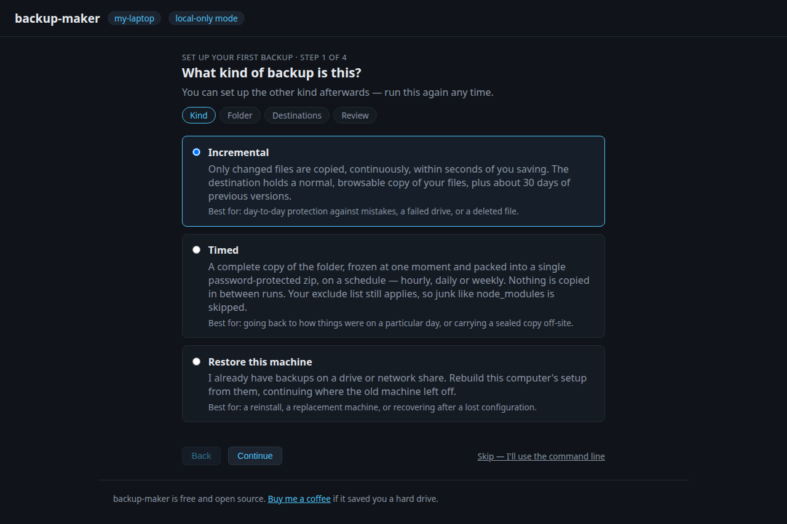
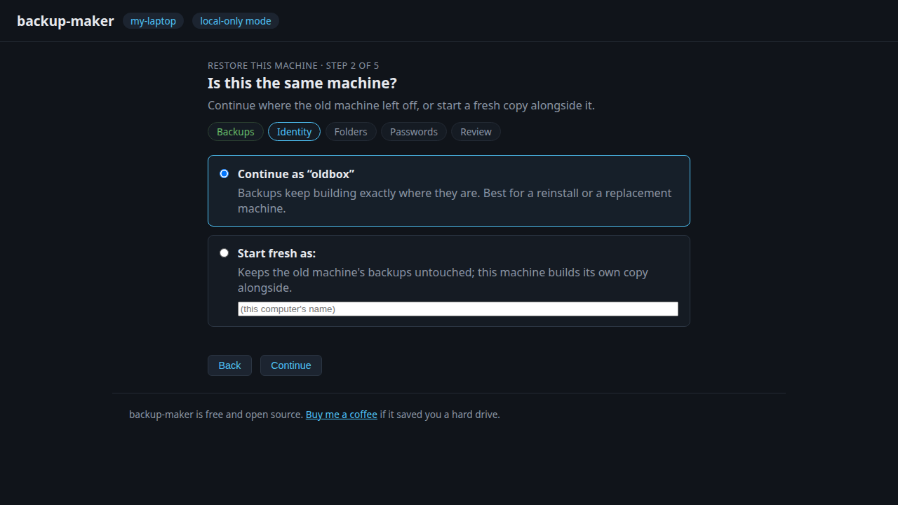

# 6. Restoring & recovery

Three situations, in the order you're likely to meet them: getting a file back,
rebuilding a whole machine from a destination that survived it, and repairing a
backup that someone edited in place. If you're here because something has
already gone wrong, start with the first section.

## Restoring

Backups are plain files — no special format. Copy them back with any file
manager. Old versions of changed/deleted files live in
`.backup-maker-versions/` (drive and network targets, at the target root) or
`.stversions/` (machine targets), named `file~20260721-153000.txt`. Restore by
copying out; don't edit files inside a backup target in place.

## Adopting a destination on a new machine

Reinstalled, or replaced the computer entirely? Point a fresh install at a
destination that already holds your backups and rebuild the whole configuration
from it. In the browser, the setup wizard offers it on a fresh machine as
**Restore this machine**:



It scans attached drives for adoptable backups (network shares can be pointed
at explicitly), asks whether this is the old machine come back or a new one
starting fresh, lets you point each folder at its new location if usernames or
the OS changed, and collects the passwords you already hold — testing share
passwords with a real connection before anything is saved.



The same flow works from the terminal:

```
backup-maker adopt /media/you/SDCARD        # a drive, card, or USB stick
backup-maker adopt //NAS/backups            # or a network share
```

Every destination carries a small non-secret manifest
(`.backup-maker-manifest.json`) listing your folders, excludes, **all** your
destinations and schedules, and the machine name — so adopting *one* reachable
destination recovers the *whole* setup, including the destinations that aren't
plugged in right now. Passwords are the one thing never written to a
destination; adopt asks you for the ones you already hold.

Adopt walks you through:

- **Continue as the old machine?** Say yes and backups keep landing in the same
  place (`<machine>/<label>/`), so history carries straight on rather than
  starting a parallel copy. Say no to start fresh as a new machine.
- **Where are the folders now?** A new username or a different OS moves paths
  around (`/home/you` → `/Users/you`); adopt shows each source folder and lets
  you point it at its new location.
- **Passwords** for any network shares and encrypted snapshots.

It refuses to run if this machine is already configured — adoption is for a
fresh install, not a merge. A destination you couldn't reach during adoption
resumes on its own the moment you reconnect it.

## When someone edits the backup itself

A received backup is a mirror, not a working copy. If files inside it are
edited, added or deleted **on the receiving machine**, that copy quietly stops
matching the machine it is supposed to be protecting — and until you look, it
still appears to be a backup.

The receiving machine now says so: drifted folders appear in
`backup-maker status`, in `backup-maker receive status` with a count of what
differs, and on its dashboard with a **Revert** button. The count is visible
on the read-only network view too, because "this backup no longer matches its
source" is exactly the kind of thing worth noticing from another room.

Putting one back:

```sh
backup-maker receive status                       # what drifted, and by how much
backup-maker receive revert <FOLDER-ID> --yes     # put it back
```

**Revert is destructive, and not symmetric.** Files *added* on the receiving
machine are **deleted** — if that machine is the only place something exists,
it is gone. Edits made there are undone, and files deleted there come back.
Nothing on the sending machine changes, and there is no undo. The dashboard
and the CLI both spell this out before doing anything, and the CLI refuses
without `--yes`.

## See also

- [Scheduled snapshots](4-snapshots.md) — how to open an encrypted archive, and
  why the password can't be recovered.
- [Security & safety properties](../reference/security.md) — the guarantees that make a
  destination worth restoring from.
- [Getting started](1-install.md) — setting up the fresh machine you just
  adopted onto.
